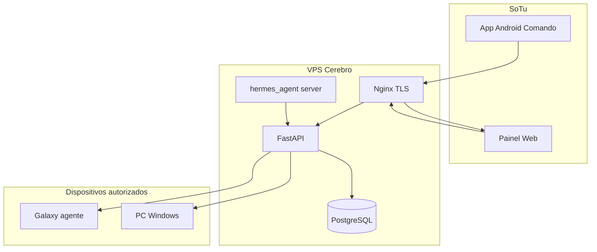

# Plano Hermes — 100% pronto para produção

Documento de referência para execução na VPS, no Galaxy S25 Ultra e nos PCs. Assume o repositório **Hermes** com código MVP + modo Comando já implementado.

**Definição de “100% pronto” (esta entrega):**

- Cérebro na VPS estável (Docker, Postgres persistente, migrações até `0002`, segredos fortes, HTTPS recomendado).
- Painel web e API públicos e coerentes com o mesmo domínio/IP.
- App Android instalada no telemóvel (tab **Comando** + tab **Este telemóvel**), apontando para a VPS.
- Agente na própria VPS (`platform: server`) + pelo menos um PC Windows pareado e a correr.
- Testes E2E documentados (ping, inventário, comando natural, revogação).
- **Fora de escopo desta entrega:** FCM push, LLM para frases livres, email/Telegram, instaladores assinados Mac App Store.

---

## Arquitetura alvo



---

## Pré-requisitos antes de dar acesso à VPS

Recolher e guardar em local seguro (não commitar no git):

| Item | Exemplo |
|------|---------|
| SSH | `user@IP` + chave ou password |
| SO | Ubuntu 22.04/24.04 ou Debian |
| Domínio (opcional) | `hermes.seudominio.com` → IP da VPS |
| Portas | 22, 80, 443 (e fechar 5432/8000 ao público) |
| Repo na VPS | Caminho onde está ou ficará o código |
| Estado atual | `docker ps`, `docker compose ps`, logs — “Hermes já está lá” |

---

## Fase 1 — Auditoria na VPS (dia 0)

**Objetivo:** Saber o que já corre e o que falta atualizar.

1. SSH na VPS; listar containers, volumes, portas (`docker ps -a`, `docker volume ls`, `ss -tlnp`).
2. Localizar projeto (`find` / `ls` em `/opt`, `/home`, etc.).
3. Comparar versão em disco com repo local (presença de `0002_command_notify`, `commands/natural`, `hermes-agent`, tab Comando no Android).
4. Verificar migração Alembic: `docker compose exec api alembic current` → deve estar em `0002` após atualização.
5. Testar `curl https://DOMINIO/healthz` ou `http://IP:8000/healthz`.
6. Registar TOTP admin existente ou planear reset controlado (`bootstrap_admin` só se DB vazio ou utilizador novo).

**Entregável:** nota curta “estado VPS antes” (containers, URLs, versão migrations).

---

## Fase 2 — Produção Docker na VPS

**Ficheiros chave:** [docker-compose.yml](../docker-compose.yml), [backend/Dockerfile](../backend/Dockerfile), [panel/Dockerfile](../panel/Dockerfile).

### 2.1 Criar `docker-compose.prod.yml` (novo)

- Não expor Postgres (`5432`) publicamente.
- API só na rede interna Docker; público via Nginx.
- Variáveis via `.env` na VPS (não versionado):
  - `HERMES_JWT_SECRET` (64+ chars aleatórios)
  - `HERMES_PAIRING_PEPPER`
  - `HERMES_ADMIN_EMAIL` / `HERMES_ADMIN_PASSWORD` (tua escolha)
  - `HERMES_CORS_ORIGINS=https://teu-dominio`
  - `HERMES_DATABASE_URL` interno `postgresql+psycopg://...@db:5432/hermes`
- Build arg do painel: `NEXT_PUBLIC_HERMES_API=https://teu-dominio/api/v1`
- Volumes nomeados `hermes_pg`, `hermes_files` (backup regular).

### 2.2 Deploy

```bash
git pull   # ou rsync do PC
docker compose -f docker-compose.yml -f docker-compose.prod.yml build
docker compose -f docker-compose.yml -f docker-compose.prod.yml up -d
docker compose exec api alembic upgrade head
docker compose logs api | grep otpauth   # só se admin novo
```

### 2.3 Nginx + TLS (recomendado)

- Reverse proxy: `/api` → `api:8000`, `/` → `panel:3000` (ou subdomínios `api.` e `panel.`).
- Certbot Let’s Encrypt; HSTS.
- Firewall: `ufw allow 22,80,443`; negar resto.

**Entregável:** URLs finais `https://DOMINIO` (painel) e API acessível em `https://DOMINIO/api/v1/healthz` (conforme roteamento).

---

## Fase 3 — Cérebro: comandos naturais e voz

**Já no código:**

- `POST /api/v1/commands/natural` — [backend/app/natural_commands.py](../backend/app/natural_commands.py)
- `GET /api/v1/hermes/voice-profile` — [backend/app/hermes_voice.json](../backend/app/hermes_voice.json)
- Migration [backend/alembic/versions/0002_command_notify.py](../backend/alembic/versions/0002_command_notify.py)

**Validar na VPS após deploy:**

```bash
# Com token admin (após login 2FA no painel ou script)
curl -X POST https://DOMINIO/api/v1/commands/natural \
  -H "Authorization: Bearer TOKEN" \
  -H "Content-Type: application/json" \
  -d '{"text":"ping no Galáxia","notify_channel":"voice"}'
```

**Melhoria opcional nesta fase (painel web):**

- Página ou secção “Comando” em [panel/](../panel/) chamando `/commands/natural` (hoje só comandos técnicos em `panel/app/devices/[id]/page.tsx`).

---

## Fase 4 — Agente na VPS (`platform: server`)

**Código:** [agents/hermes-agent/](../agents/hermes-agent/)

1. Na VPS (host ou container sidecar): `pip install -r agents/hermes-agent/requirements.txt`
2. Painel → **Pairing** → código novo.
3. `python -m hermes_agent pair --server https://DOMINIO --code XXXXX --name VPS-Brain --platform server`
4. Serviço persistente:
   - **systemd** unit `hermes-agent.service` (`ExecStart=python -m hermes_agent run`)
   - `Restart=always`
5. Testar do painel ou app: comandos `server_docker_ps`, `server_disk`, `ping`.

**Nota Docker na VPS:** Se o Hermes corre em Docker, o agente `server_docker_ps` precisa acesso ao socket Docker (`/var/run/docker.sock` montado ou agente no host). Documentar qual opção escolheste.

---

## Fase 5 — Agente Windows (e opcional Linux/Mac)

**Windows (prioridade):**

1. Instalar Python 3.11+ no PC.
2. Copiar pasta `agents/hermes-agent` ou clonar repo.
3. Pairing: `--platform windows`, nome ex. `PC-Casa`.
4. Executar em background:
   - Agendador de Tarefas ao login, ou
   - `nssm`/serviço Windows a correr `python -m hermes_agent run --interval 20`
5. Firewall Windows: permitir saída HTTPS para a VPS.

**Linux / macOS:** mesmo fluxo com `--platform linux` ou `--platform macos` ([agents/hermes-agent/README.md](../agents/hermes-agent/README.md)). Mac usa `say` para voz local; sem bloqueio Apple para agente pessoal.

---

## Fase 6 — App Android no Galaxy S25 Ultra

**Código:** `android/app/src/main/java/com/hermes/app/` (`MainActivity.kt`, `CommanderScreen.kt`, `voice/HermesVoice.kt`).

### 6.1 Build de produção

- Em `android/app/build.gradle.kts`, alterar `API_BASE_URL` para `https://DOMINIO` (sem `/api/v1` — o código acrescenta).
- Ou `local.properties`: `hermes.api.base=https://DOMINIO`
- Android Studio: **Sync** → **Rebuild** → **Run** no dispositivo (release/debug).

### 6.2 Configuração no telemóvel

| Tab | Ação |
|-----|------|
| **Comando** | URL `https://DOMINIO`, login admin + 2FA, aviso “Voz Hermes”, testar “inventário do Galáxia” |
| **Este telemóvel** | URL mesma, código Pairing novo, nome `Galáxia S25 Ultra` (agente) |

Permissões: notificações, microfone (voz), rede.

### 6.3 Correções já no repo (reinstalar)

- `ACCESS_NETWORK_STATE` no manifest (inventário).
- `feature:status` JVM 17 alinhado.

**Entregável:** app instalada; dashboard mostra dispositivo; `get_inventory` **done**.

---

## Fase 7 — Testes E2E (checklist)

| # | Teste | Esperado |
|---|--------|----------|
| 1 | `GET /healthz` | `ok` |
| 2 | Login painel + 2FA | Dashboard |
| 3 | Pairing → Galaxy | Device na lista |
| 4 | `ping` no Galaxy | done ~30s |
| 5 | `get_inventory` Galaxy | done com JSON |
| 6 | App Comando: “ping no PC Casa” | comando criado, done |
| 7 | `request_upload` + ficheiro no telemóvel | done |
| 8 | `server_docker_ps` na VPS | done |
| 9 | Revogar DockerTest antigo | revoked |
| 10 | Revogar + re-pair teste | 401 após revogar |

Registar resultados em [TESTES_E2E.md](TESTES_E2E.md).

---

## Fase 8 — Segurança e operação

- [ ] Trocar passwords default (`change-me-now`) e JWT/pepper de dev.
- [ ] Postgres não exposto à internet.
- [ ] Backups: `pg_dump` + volume `hermes_files` (cron semanal).
- [ ] `docker compose logs` sem secrets em claro.
- [ ] Apenas tua conta admin; 2FA obrigatório.
- [ ] Rever dispositivos no dashboard; revogar testes (`DockerTest`).
- [ ] Opcional: fail2ban SSH, atualizações automáticas de segurança.

---

## Fase 9 — Documentação no repo

| Ficheiro | Conteúdo |
|----------|----------|
| [PLANO_PRODUCAO.md](PLANO_PRODUCAO.md) | Este plano |
| [DEPLOY_VPS.md](DEPLOY_VPS.md) | Comandos copy-paste VPS + Nginx |
| [TESTES_E2E.md](TESTES_E2E.md) | Resultados dos testes |
| [README.md](../README.md) | Link para deploy produção |

---

## Ordem de execução recomendada

```text
1. Auditoria VPS
2. Deploy Docker + migrate 0002 + secrets
3. Nginx/TLS
4. Bootstrap admin / TOTP no Authenticator
5. Agente VPS (server)
6. App Android (Run) + pareamento Galaxy
7. Agente Windows
8. Testes E2E + docs
9. Hardening segurança
```

---

## Checklist de tarefas (tracking)

| ID | Tarefa | Estado |
|----|--------|--------|
| vps-audit | Auditar VPS: containers, volumes, migrações, URLs | pendente |
| prod-compose-nginx | `docker-compose.prod.yml` + `.env` + Nginx/TLS + firewall | pendente |
| deploy-migrate | Deploy build, `alembic upgrade head` 0002, bootstrap/TOTP | pendente |
| agent-vps | `hermes-agent` na VPS (`platform server`) + systemd | pendente |
| agent-windows | Agente Windows pareado + serviço persistente | pendente |
| android-release | Build app com `API_BASE_URL` produção + Galaxy | pendente |
| panel-natural-optional | Opcional: comando natural no painel web | pendente |
| e2e-docs | Checklist E2E + `TESTES_E2E.md` + `DEPLOY_VPS.md` | pendente |
| security-hardening | Rotação secrets, revogar devices teste, backup | pendente |

---

## O que precisas na sessão de execução

1. SSH (host, user, chave).
2. Domínio ou IP público definitivo.
3. Confirmação se queres **HTTPS obrigatório** já nesta entrega.
4. Nome/email/password admin desejados (ou manter reset via logs).
5. Quantos PCs parear na primeira vaga (só Windows ou também Mac/Linux).

---

## Riscos e mitigação

| Risco | Mitigação |
|-------|-----------|
| VPS com código antigo | `git pull` + rebuild + `alembic upgrade head` |
| Painel com API URL errada | Rebuild panel com `NEXT_PUBLIC_HERMES_API` correto |
| App com IP local | `API_BASE_URL` = domínio HTTPS |
| Código pairing expirado | Gerar novo no painel (<10 min) |
| Docker socket no agente VPS | Agente no host, não dentro do container API |
| Firewall bloqueia telemóvel | Testar `curl` do telemóvel ou browser para `/healthz` |
