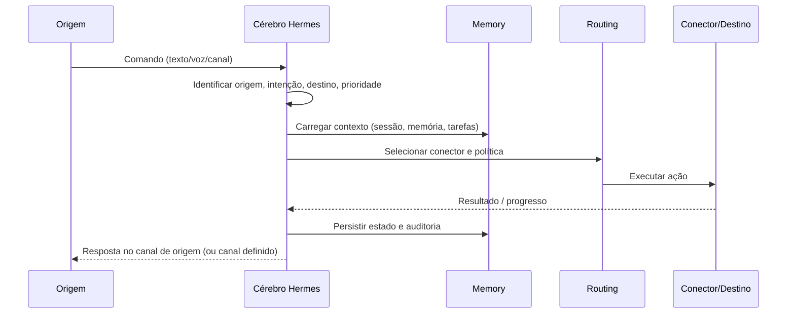

# SDD — Hermes / Jarvis Unificado

| Campo | Valor |
|-------|--------|
| **Documento** | Software Design Document (SDD) |
| **Sistema** | Hermes — Jarvis Unificado |
| **Versão** | 1.0.0 |
| **Status** | Aprovado para uso como contexto-base de desenvolvimento |
| **Última atualização** | 2026-05-19 |
| **Repositório** | `jarvis-horizon` (+ runtime Hermes Agent em `~/.hermes`) |

---

## 1. Resumo executivo

O **Hermes — Jarvis Unificado** é um assistente central com um único cérebro de orquestração, capaz de receber comandos de qualquer dispositivo autenticado, manter contexto persistente, executar tarefas longas (incluindo código), integrar mensagens e e-mail, e acionar remotamente VPS, PC, celular e serviços conectados.

**Definição operacional (uma linha):**

> Um único Hermes central, com qualquer dispositivo podendo acionar qualquer outro, mantendo contexto persistente, execução contínua, roteamento por intenção e integração com código, e-mail, WhatsApp e dispositivos.

Este documento é a **fonte da verdade** do produto. Toda implementação deve ser avaliada contra as invariantes da seção 13 e os critérios da seção 15.

---

## 2. Objetivo do produto

Construir um assistente central único, com comportamento de “cérebro Jarvis”, capaz de:

| Capacidade | Descrição |
|------------|-----------|
| Entrada omnicanal | Comandos por texto, voz, painel web, app Android, WhatsApp e CLI |
| Continuidade | Retomar projetos de código e tarefas longas entre sessões e dispositivos |
| Comunicação | Ler/responder e-mail; enviar mensagens no WhatsApp |
| Controle remoto | VPS, PC, celular e automações autorizadas |
| Contexto unificado | Memória, preferências e histórico compartilhados pelo cérebro |
| Ambiente controlado | Acesso amplo, mas com escopos, confirmações e auditoria |

---

## 3. Princípio central

### 3.1 Um agente, muitos alvos

Existe **um único agente central** (Hermes) que interpreta, planeja e coordena. Dispositivos e conectores são **mãos**, não cérebros independentes.

### 3.2 Regra de roteamento entre dispositivos

**Qualquer dispositivo autenticado pode acionar qualquer outro dispositivo autorizado**, desde que:

- a política de escopo permita a ação;
- a proveniência (origem) fique registrada;
- ações críticas passem por confirmação quando exigido.

| Origem → Destino | Exemplo |
|------------------|---------|
| Celular → VPS | “Reinicia o container do backend.” |
| PC → Celular | “Silencia o telefone e ativa foco.” |
| VPS → PC | “Roda os testes no repositório X.” |
| Qualquer → WhatsApp | “Avisa o João que o deploy terminou.” |
| Qualquer → Projeto de código | “Continua o PR #42.” |

O celular é **interface**, não cérebro. A VPS hospeda o cérebro e também pode ser alvo de ação.

---

## 4. Visão de SDD (uso deste documento)

Sempre que houver codificação neste projeto, preservar:

1. Identidade do sistema (Jarvis unificado, não coleção de bots).
2. Arquitetura unificada (um cérebro + conectores).
3. Roteamento entre dispositivos com proveniência explícita.
4. Contexto contínuo e retomável.
5. Integração de mensagens, e-mail e código no mesmo fluxo.
6. Logs e auditoria obrigatórios.

**Perguntas de revisão (obrigatórias por PR/módulo):**

- Isso reforça o agente único?
- Isso preserva o roteamento entre dispositivos?
- Isso mantém contexto e continuidade?
- Isso respeita a ideia de Jarvis central?
- Isso registra origem, destino e resultado?

---

## 5. Escopo funcional

### 5.1 Dentro do escopo

- Comandos por texto e voz
- Continuidade de projetos de código
- Leitura e resposta de e-mail
- Envio de mensagens no WhatsApp
- Ações remotas entre dispositivos
- Automação de VPS e PC
- Monitoramento de tarefas longas
- Histórico e auditoria
- Retomada de contexto entre sessões

### 5.2 Fora do escopo inicial

| Item | Motivo |
|------|--------|
| Múltiplos agentes independentes | Viola invariante de cérebro único |
| Vários cérebros distribuídos | Complexidade e perda de contexto |
| Inteligência rígida por dispositivo | Celular/PC não decidem sozinhos |
| Automações sem rastreabilidade | Viola auditoria obrigatória |
| Comandos sem contexto/histórico | Viola continuidade |

---

## 6. Entidades do domínio

### 6.1 Agente central (Hermes)

**Responsabilidades:**

- Interpretar comandos (NLU / planejamento)
- Classificar intenção e prioridade
- Rotear para o destino correto
- Executar ou delegar tarefas
- Registrar eventos e resultados
- Manter memória do usuário e do ambiente

**Implementação de referência:** Hermes Agent (`hermes` CLI, gateway em `~/.hermes`, provider LLM configurável).

### 6.2 Origem (`Origin`)

De onde o comando partiu. Atributos mínimos: `origin_type`, `origin_id`, `channel`, `timestamp`.

| `origin_type` | Exemplos |
|---------------|----------|
| `mobile` | App Android (tab Comando) |
| `desktop` | PC Windows/Linux/macOS |
| `server` | VPS / agente `platform: server` |
| `web` | Painel Next.js |
| `messaging` | WhatsApp, Telegram |
| `voice` | Entrada por voz |
| `cli` | Terminal `hermes` |

### 6.3 Destino (`Target`)

Onde a ação será executada.

| `target_type` | Exemplos |
|---------------|----------|
| `device` | Celular, PC, VPS (via fila de comandos) |
| `channel` | WhatsApp, e-mail |
| `workspace` | Repositório / projeto de código |
| `service` | Docker, systemd, Home Assistant |
| `browser` | Automação web |

### 6.4 Intenção (`Intent`)

O que o usuário quer. Classificação orienta roteamento e modelo LLM (quando aplicável).

Exemplos: `continue_coding`, `reply_email`, `send_message`, `restart_service`, `open_app`, `monitor_task`, `query_status`.

### 6.5 Resultado (`Outcome`)

Estado final da execução.

| Estado | Significado |
|--------|-------------|
| `completed` | Concluído com sucesso |
| `in_progress` | Em andamento (modo contínuo) |
| `failed` | Falhou (erro registrado) |
| `awaiting_confirmation` | Aguardando aprovação do usuário |
| `delivered_summary` | Resumo entregue ao canal de origem |

---

## 7. Regras de arquitetura

| ID | Regra | Descrição |
|----|-------|-----------|
| AR-01 | Um cérebro, muitos alvos | Um ponto de inteligência; N pontos de execução |
| AR-02 | Roteamento por intenção | Destino escolhido pela intenção, não só pelo canal de entrada |
| AR-03 | Execução contínua | Tarefas longas sobrevivem a troca de dispositivo |
| AR-04 | Estado persistente | Sessões, memória e filas não se perdem entre reinícios |
| AR-05 | Auditoria obrigatória | Toda ação relevante gera registro consultável |

**Padrão de segurança (complementar):** “um cérebro, muitas mãos” — três níveis: leitura automática, escrita com escopo, ações críticas com confirmação. Ver `~/.hermes/skills/.../references/jarvis-architecture.md`.

---

## 8. Modos de operação

| Modo | Comportamento | Exemplo |
|------|---------------|---------|
| **Interativo** | Pedido → resposta imediata | “Que horas são?” |
| **Contínuo** | Tarefa aberta até conclusão | “Continua o backend do jarvis-horizon.” |
| **Paralelo** | Várias atividades simultâneas | Codar + monitorar WhatsApp + observar VPS |
| **Cruzado** | Dispositivo A controla B | Celular reinicia serviço na VPS |

---

## 9. Fluxo padrão de uma ação

| Passo | Ação |
|-------|------|
| 1 | Comando recebido no canal de origem |
| 2 | Agente identifica origem, intenção, destino, prioridade |
| 3 | Agente consulta contexto atual (sessão + memória + tarefas abertas) |
| 4 | Agente seleciona conector (terminal, API dispositivo, WhatsApp, e-mail, etc.) |
| 5 | Execução com retries/timeout conforme política |
| 6 | Resultado retorna à origem ou canal configurado; auditoria gravada |

---

## 10. Componentes de software

### 10.1 Mapa lógico → implementação atual

| Camada SDD | Responsabilidade | Onde está hoje |
|------------|------------------|----------------|
| **Core do agente** | Raciocínio, planejamento, skills | Hermes Agent (`~/.hermes`, `hermes gateway`, CLI) |
| **Memory layer** | Preferências, projetos, rotinas | `~/.hermes/memories/`, sessões JSON, SOUL.md |
| **Routing layer** | Origem → destino por intenção | Parcial: `natural_commands.py`, system prompt, futuro módulo dedicado |
| **Connector layer** | E-mail, WhatsApp, terminal, APIs | Gateway platforms, MCP, `hermes_agent`, OpenCode CLI |
| **Audit layer** | Trilha de ações | `audit_logs` (API), `~/.hermes/logs/`, `write_audit()` |

### 10.2 Monorepo `jarvis-horizon`

| Módulo | Papel no SDD |
|--------|----------------|
| `backend/` | API do cérebro operacional: dispositivos, comandos, auditoria, pareamento |
| `panel/` | Interface web de administração |
| `android/` | Interface móvel (agente local + tab Comando) |
| `agents/hermes-agent/` | Agente leve em PC/VPS que consome fila de comandos |
| `docs/` | SDD, plano de produção, OpenAPI, deploy |

### 10.3 Runtime Hermes Agent (VPS)

| Componente | Função |
|------------|--------|
| `hermes gateway run` | Processo central: WhatsApp, sessões, LLM |
| `config.yaml` | Modelo, terminal, conectores, personalidade |
| `auth.json` | Credenciais OAuth/API (Codex, OpenRouter, etc.) |
| WhatsApp bridge | Conector de mensagens |

---

## 11. Modelo de dados (API — dispositivos e comandos)

Entidades já modeladas em `backend/app/models.py`:

- **User** — administrador (painel, TOTP)
- **Device** — dispositivo pareado (celular, PC, VPS)
- **Command** — job enfileirado para um dispositivo
- **AuditLog** — trilha de auditoria
- **FileRecord** — artefatos de upload/download

**Proveniência de comando (implementado):**

- `created_by_user_id` — comando criado por admin no painel
- `created_by_device_id` — dispositivo A cria comando para dispositivo B (roteamento cruzado)

Isso materializa a regra “qualquer dispositivo aciona qualquer outro” no nível da API, com registro explícito.

---

## 12. Regras de contexto fixo para codificação

Ao implementar qualquer módulo, manter verdadeiro:

- [ ] Existe um único agente central
- [ ] O sistema é Jarvis unificado (não multi-bot)
- [ ] Qualquer dispositivo pode acionar qualquer outro (com auth + auditoria)
- [ ] Celular é interface, não cérebro
- [ ] VPS, PC e celular são origens e destinos
- [ ] Contexto contínuo entre sessões
- [ ] Tarefas longas não se perdem
- [ ] Mensagens, e-mail e código no mesmo fluxo conceitual
- [ ] Logs e auditoria obrigatórios

---

## 13. Invariantes do sistema

**Não quebrar durante o desenvolvimento:**

| ID | Invariante |
|----|------------|
| INV-01 | Não criar múltiplos cérebros independentes |
| INV-02 | Não perder contexto do usuário sem política explícita de retenção |
| INV-03 | Não remover roteamento entre dispositivos |
| INV-04 | Não quebrar continuidade de tarefas longas |
| INV-05 | Não abandonar logs e histórico |
| INV-06 | Não permitir ações sem controle ou rastreio |

---

## 14. Casos de uso principais

| ID | Caso de uso | Fluxo resumido |
|----|-------------|----------------|
| UC-01 | Continuação de projeto | Origem qualquer → cérebro → terminal/OpenCode no workspace → resultado na origem |
| UC-02 | Ação remota entre dispositivos | Celular → API `POST /devices/{id}/commands` → agente no destino executa |
| UC-03 | Comunicação integrada | Cérebro → conector e-mail → rascunho/resposta → confirmação se crítico |
| UC-04 | Automação cruzada | PC → comando para device Android → app executa (silenciar, foco) |
| UC-05 | Supervisão simultânea | Modo paralelo: sessão de código + gateway WhatsApp + monitor VPS |

---

## 15. Critérios de aceitação (Definition of Done — produto)

O projeto está aderente ao SDD quando:

| # | Critério | Verificação |
|---|----------|-------------|
| AC-01 | Receber comando de qualquer dispositivo | CLI, WhatsApp, Android Comando, painel |
| AC-02 | Rotear para qualquer dispositivo autorizado | `created_by_device_id` + política de escopo |
| AC-03 | Continuar tarefas entre sessões | Sessões Hermes + estado de comando `pending/running` |
| AC-04 | Manter contexto consistente | Memória + histórico de sessão consultável |
| AC-05 | Executar em e-mail, WhatsApp, VPS e PC | Conectores ativos e testados E2E |
| AC-06 | Registrar tudo que foi feito | `audit_logs` + logs do gateway |
| AC-07 | Responder com estado claro da ação | `status`, `result`, notificação configurável |

---

## 16. Estratégia de desenvolvimento (fases)

| Fase | Objetivo | Estado | Entregáveis |
|------|----------|--------|-------------|
| **1** | Consolidar núcleo único do Hermes | Em progresso | Gateway estável, auth LLM, DNS/rede VPS |
| **2** | Memória persistente | Parcial | `memories/`, sessões; expandir API se necessário |
| **3** | Roteamento entre dispositivos | Parcial | `created_by_device_id`, testes API; políticas de escopo |
| **4** | E-mail e WhatsApp | Parcial | WhatsApp via gateway; Google Workspace via skills |
| **5** | Continuidade de tarefas de código | Parcial | OpenCode CLI, terminal; kanban/cron futuro |
| **6** | Auditoria, logs e rastreio | Parcial | `AuditLog`, logs `~/.hermes/logs/` |
| **7** | Automações e integrações | Planejado | Home Assistant, Evolution API, FCM |

**Ordem recomendada:** completar Fase 1 → 3 → 6 antes de expandir integrações (Fase 7).

---

## 17. Blueprint de implementação por módulo

### 17.1 Módulo: Routing Layer (API)

**Objetivo:** Decisão explícita origem → intenção → destino.

| Item | Especificação |
|------|----------------|
| Entrada | `NaturalCommandRequest` ou comando estruturado |
| Saída | `{ intent, target_device_id?, connector, priority }` |
| Persistência | Opcional em `Command.source_text` + metadados de auditoria |
| Arquivo alvo | `backend/app/routing/` (novo) ou extensão de `natural_commands.py` |

### 17.2 Módulo: Cross-device commands

**Objetivo:** Dispositivo autenticado enfileira comando em outro.

| Endpoint | `POST /api/v1/devices/{device_id}/commands` |
| Auth | `get_current_actor` (User ou Device) |
| Campos | `created_by_device_id`, `source_text`, `notify_*` |
| Testes | `backend/tests/test_api.py` |

### 17.3 Módulo: Hermes Gateway (cérebro LLM)

**Objetivo:** Orquestração conversacional e ferramentas.

| Config | `~/.hermes/config.yaml` |
| Conectores | terminal, browser, WhatsApp, MCP |
| Invariante | Um gateway por instância = um cérebro |

### 17.4 Módulo: Audit Layer

**Objetivo:** Trilha unificada.

| API | `GET /api/v1/audit` |
| Agente | `write_audit()` em mutações |
| Gateway | `agent.log`, `errors.log`, `gateway.log` |

### 17.5 Módulo: Memory Layer (agente)

**Objetivo:** Contexto Jarvis entre sessões.

| Artefatos | `USER.md`, `MEMORY.md`, sessões JSON |
| Política | Curador periódico (`curator` em config) |

---

## 18. Referências cruzadas

| Documento | Uso |
|-----------|-----|
| [PLANO_PRODUCAO.md](./PLANO_PRODUCAO.md) | Deploy VPS, Android, E2E |
| [DEPLOY_VPS.md](./DEPLOY_VPS.md) | Procedimentos de deploy |
| [TESTES_E2E.md](./TESTES_E2E.md) | Checklist de validação |
| [../README.md](../README.md) | Quick start do monorepo |
| `~/.hermes/skills/.../jarvis-architecture.md` | Notas de arquitetura no agente |
| `docs/openapi/hermes-v1.yaml` | Contrato HTTP |

---

## 19. Controle de versão deste SDD

| Versão | Data | Alteração |
|--------|------|-----------|
| 1.0.0 | 2026-05-19 | Versão inicial formal (formato 1) a partir do planejamento Jarvis/Hermes |

**Próximos formatos opcionais (não substituem este SDD):**

- PRD de produto (métricas, personas, roadmap comercial)
- README de arquitetura resumido para onboarding
- Blueprint detalhado por sprint (derivado da seção 17)

---

*Documento gerado para uso contínuo como contexto-base em sessões de codificação do Hermes / Jarvis Unificado.*
